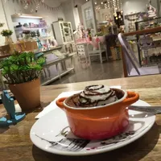

# Transformation Parameters

## Basic image resizing 

### Width - \(w\) 

Used to specify the width of the output image. Accepts integer value greater than 1. If a value between 0 and 1 is specified, it acts as a percentage width. Therefore, 0.1 means 10% of the original width, 0.4 means 40% of the original width, and so on.







Transformation - `w-200`



{% tab title="40% width of original image" %}
Transformation - `w-0.4` 




### Height - \(h\) 

Used to specify the height of the output image. Accepts integer value greater than 1. If a value between 0 and 1 is specified, the value acts as a percentage height. Therefore, 0.1 means 10% of the original height, 0.4 means 40% of the original height, and so on.







Transformation - `h-200`



{% tab title="40% height of the original image" %}
Transformation - `h-0.4`




### Aspect ratio - \(ar\) 

Used to specify the aspect ratio of the output image or the ratio of width to height of the output image. This parameter must be used along with either the [height\(h\)]() or [width\(w\)]() parameter. The format for specifying this transformation is `ar-<width>-<height>`


If you specify both [height\(h\)]() and [width\(w\)]()  along with [aspect ratio\(ar\)](), then the aspect ratio is ignored.








Transformation - `w-400 ar-4-3`




## Crop, Crop Modes and Focus 

If only, one of the [height\(h\)]() or [width\(w\)]() dimension is specified, this automatically adjusts the other dimension accordingly to preserve aspect ratio and no cropping takes place.

But when you specify both [height\(h\)]() and [width\(w\)]() dimension, you need to choose the right cropping strategy based on your website layout and desired output image.


**Tip for choosing the right cropping strategy**😎  
****When choosing among different strategies for cropping, think in terms of your website layout and desired output image.


* If you want to preserve the whole image content \(no cropping\) and need the exact same dimensions \(height and width\) in the output image as requested, choose either of the [pad resize crop]() or [forced crop strategy]().
* If you want to preserve the whole image content \(no cropping\), but it is okay if one or both the dimensions \(height or width\) in the output image are adjusted to preserve the aspect ratio. Then choose either of the [max-size cropping]() or [min-size cropping strategy]().
* If you need the exact same dimensions \(height and width\) in the output image as requested but it's okay to crop the image to preserve aspect ratio \(or extract a region from the original image\). Then choose either of the [maintain ratio crop]() or [extract crop]() or [pad extract crop strategy](). You can combine the extract crop strategy with different [focus values]() to get the desired result.

### Pad resize crop strategy - \(cm-pad\_resize\) 

In the pad resize crop strategy, the output image's dimension \(height and width\) is the same as requested, no cropping takes place, and the aspect ratio is preserved. This is accomplished by adding padding around the output image to get it to match the exact dimension as requested.







Transformation - `w-300 h-200 cm-pad_resize bg-F3F3F3`

The output image is exactly 300x200. However, to maintain the aspect ratio and prevent cropping a solid colored padding is added around the resized image.

For sake of clarity, we have made the padding background slightly grey in color \(\#F3F3F3\) by adding the background parameter \(`bg`\).



#### Example - All padding on one side 

In the examples above, we saw that when the image is padded using the [pad resize crop strategy](), the padding is equal on both sides of the image. However, there might be cases where we want all the padding to be added on only one side of the image. This can be done using the [focus \(fo\)]() parameter.



Transformation - `w-300 h-200 cm-pad_resize bg-F3F3F3 fo-left`

We added the `fo-left` transformation to our image. Now, all the padding is on the right of the image, while the image itself is on the left \(determined by the value of [focus\(fo\)]() parameter\).








### Forced crop strategy - \(c-force\) 

In a forced crop strategy, the output image's dimension \(height and width\) is exactly the same as requested, no cropping takes place, but the aspect ratio is not preserved. It forcefully squeezes the original image to get it to fit completely within the output dimensions.







Transformation - `w-300 h-200 c-force`

The entire original image is preserved in the output image as well, but the hand and the plant have been squeezed to fit into the output image.



### Max-size cropping strategy - \(c-at\_max\) 

In the max-size crop strategy, whole image content is preserved \(no cropping\), the aspect ratio is preserved, but one of the dimensions \(height or width\) is adjusted.

The output image is less than or equal to the dimensions specified,i.e., at least one dimension will exactly match the output dimension requested, and the other dimension will be equal to or smaller than the corresponding output dimension requested.







Transformation - `w-300 h-200 c-at_max` 

The entire image content and the aspect ratio is preserved. The output image dimensions are 148x200. So the height is exactly what is requested, but the width is smaller than what was requested. 

This mode is particularly useful if you have a container and you want to ensure that the image will never be larger than that container.



### Min-size cropping strategy - \(c-at\_least\) 

This strategy is similar to the [max-size cropping strategy](), with the only difference being that unlike the max-size strategy, the image is equal to or larger than the requested dimensions. One of the dimensions will be exactly the same as what is requested, while the other dimension will be equal to or larger than what is requested.







Transformation - `w-300 h-200 c-at_least`

The entire image content and aspect ratio is preserved. The output image dimensions are 300x405. So the width is exactly the same as what was requested, but the height is larger than what was requested.

This is useful for cases where you want to have an image that is always at least as large as the container.



### Maintain ratio crop strategy - \(c-maintain\_ratio\) 

This is the default crop strategy. If nothing is specified, this strategy gets applied automatically. In this strategy, the output image's dimension \(height and width\) is the same as requested, and the aspect ratio is preserved. This is accomplished resizing the image to the requested dimension and in the process cropping parts from the original image.


By default we extract the image from the center but you can change this using [focus parameter]().








Transformation - `w-300 h-200 c-maintain_ration`

In the above image, the top and the bottom of the image got cropped out. But the aspect ratio has been preserved from the original to the output image i.e. the hand and the plant are not skewed or forcefully resized to fit the output dimensions.



Original 

Using c-maintain\_ratio with fo-custom - `w-500 h-100 fo-custom` 




### Extract crop strategy - \(cm-extract\)

In this strategy, the output image's dimension \(height and width\) is exactly the same as requested, and the aspect ratio is preserved. In this strategy, instead of trying to resize the image as we did in [maintain ratio strategy](), we extract out a region of the requested dimension from the original image.


By default we extract the image from the center but you can change this using [focus parameter]().


#### Examples - Center and relative focus 







Transformation - `w-200 h-200 cm-extract`

The size of the hand and the plant has not changed at all from the original image, which means that no resizing has taken place. Instead, we have been able to extract out a 200x200 area from the original image. This is the regular center extract.



In the relative method, you can use the [focus \(fo\) parameter]() to specify that the extract should be done from, let's say, the bottom-right of the original image.

Valid relative values for `fo` parameters are - `center`, `top`, `left`, `bottom`, `right`, `top_left`, `top_right`, `bottom_left` and `bottom_right`.

Example transformation - `w-300 h-300 cm-extract fo-bottom_right` 




#### Examples - Focus using cropped image coordinates 

#### Example - **Focus using custom coordinates** 

### Focus - \(fo\) 

This parameter can be used along with [pad resize](), [maintain ratio]() or [extract crop]() to change the behaviour of padding or cropping. Learn more from the different examples shown in respective sections.

This parameter can have following values depending upon where it is being used:

1. `left`, `right`, `top`, `bottom` can be to control the position of padding when used with pad resize. [Learn from example]().
2. `fo-custom` can be used to define a specific focus area when used with [maintain ratio]() and [extract crop]().
3. `center`, `top`, `left`, `bottom`, `right`, `top_left`, `top_right`, `bottom_left` and `bottom_right` can be used to define relative cropping during extract crop. [Learn from examples]().

Apart from above, `fo` parameter also have two additional options that intelligently detect the most important part of an image to create thumbnails i.e. `auto` and `face`. Let's see them in action:

#### Auto smart cropping - \(fo-auto\) 

In this mode, We automatically determines the most important part of the image and preserves it in the output thumbnail. This is enabled by passing the `fo-auto` parameter in the URL transformation parameters.

#### Face cropping - \(fo-face\) 

In face crop, the crop works more like the [extract crop strategy](), but instead of focusing on the center of the image, it finds out the face \(or multiple faces\) in the image and focuses around that. This gives you perfect thumbnails with just the subject's face that make up for good profile pictures.

This mode is enabled using 'fo-face' parameter in the URL transformation parameters.

**Note:** Smart crop may not give accurate results for some images. This is partially a trade off between speed \(needed for real-time transformations\) and accuracy.

## Commonly used transformations 

### Quality - \(q\) 

Used to specify the quality of the output image for lossy formats like JPEG, WebP and AVIF.  A large quality number indicates a larger output image size with high quality. A small quality number indicates a smaller output image size with lower quality. 

**Default Value** - `80` \(can be managed from image settings in dashboard\)

### Format - \(f\) 

Used to specify the format of the output image. If no output image format is specified then based on your image settings in the dashboard, We automatically picks the best format for that image request.

 Possible values include `auto` ,`jpg` , `jpeg` , `webp`, `avif` and `png`

**Default Value** - `auto` \(from dashboard settings\)

### Blur - \(bl\) 

Used to specify the gaussian blur that must be applied to an image. The value of `bl` specifies the radius of the Gaussian Blur that is to be applied. Higher the value, larger the radius of Gaussian Blur.  Possible values include integers between `1` and `100` .

### Grayscale - \(e-grayscale\) 

Used to turn an image to a grayscale version.​

### Progressive image - \(pr\) 

Used to specify whether the output JPEG image must be rendered progressively. In progressive loading, the output image renders as a low quality pixelated full image which over time keeps on adding more pixels and information to the image.  This helps you maintain a fast perceived load time.  **Possible values** include `true`  and `false`. ​

### Lossless WebP and PNG - \(lo\) 

Used to specify whether the output image \(if in JPEG or PNG\) must be compressed losslessly. In lossless compression, the output file size is larger than the regular lossy compression. However, the perceived image quality can be higher in certain cases, especially for computer-generated graphics. Using lossless compression for photographs is not recommended. **Possible Values**- `true`  and `false`  ​

### Trim edges - \(t\) 

Useful with images that have a solid or nearly solid background with the object in the center. This parameter trims the background from the image, leaving only the central object in the output image. 

Usage - `t-true|Number` **Possible Values** include `true`  and integer values between `1`  and `99` that specify the threshold level for considering a particular pixel as "background".

### Border - \(b\) 

This adds a border to the image. It accepts two parameters - the width of the border and the color of the border.

Usage - `b-<border-width>-<hex code>`

The width is specified as a number which is equivalent to the border width in pixels. The color code is specified as a 6-character hex code RRGGBB.

### Color profile - \(cp\) 

It is used to specify whether the output image should contain the color profile that is initially available with the original image. It is recommended to remove the color profile before serving the images on web and apps.  However, if you feel that the output image looks faded or washed out, and want to preserve the colors of your original image, you should set this parameter to `true`.

**Default Value**- `false`

**Possible Values**- `true` and `false` 

### Image metadata - \(md\)

It is used to specify whether the output image should contain all the metadata that is initially available with the original image. Image metadata is not relevant for rendering on the web and apps. It is, thus, recommended to not use it while delivering images. The only situation to enable the metadata option is when you want additional data like camera information, lens information, and other image profiles attached to your original image. 

**Default Value**- `false` 

**Possible Values**- `true` and `false` 

### Rotate - \(rt\) 

It is used to specify the degree by which the output image must be rotated or specifies the use of EXIF Orientation Tag for the rotation of image using the `auto` parameter.

**Possible Values**- `0` , `90` , `180` , `270` , `360` , and `auto`

Use `auto` if you want to automatically rotate image based on EXIF orientation tag in image metadata.

### Radius - \(r\) 

It is used to specify the radius that must be used to obtain a rounded output image. To obtain a perfectly rounded image, set the value to `max` . This parameter is applied after resizing the original image, if defined.

**Possible Values** - Positive Integer and `max`

For simpler cases, you can use radius in the same transformation as the height and width parameters. However, if you are using advanced cropping parameters, like crop \(c\) and crop mode \(cm\), then you should chain the radius transformation in a step after the resizing transformation.

### Background color - \(bg\) 

It is used to specify the background color in RGB Hex Code \(e.g. FF0000\) or an RGBA Code \(e.g. FFAABB50\) that must be used for the image. If you specify an 8 character background, the last two characters must be a number between `00` and `99` , which is used to indicate the opacity level of the background. 

`00` represents an opacity level of 0.00, `01`  represents opacity level 0.01, and so on. **Default Value** - Black 00000

**Possible Values** - Valid RGB Hex Code

### Original image - \(orig\) 

By default, any image always gets optimized in some way or the other. While this automatic optimization is great for web and apps, there might be certain cases where you want to get the original image as is. You can do so by using the parameter `orig`  and set the value to `true` .  If there are any other transformation parameters specified along with `orig-true` , then those get ignored.

